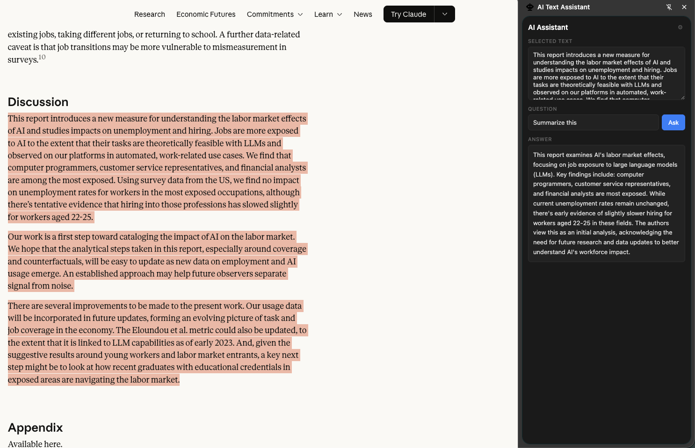
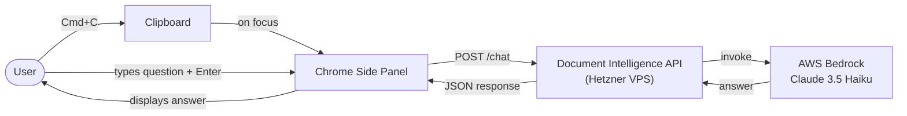

# AI Text Assistant — Chrome Extension

A Chrome side panel extension that auto-fills with your copied text and lets you ask Claude questions about it.

## Architecture

## How it works

1. Copy any text on any page (`Cmd+C`)
2. Open the side panel (`Cmd+Shift+Y` or click the toolbar icon)
3. The copied text is pre-filled automatically
4. Type your question and press `Enter`

## Stack

- **Chrome Side Panel API** — docked panel, stays open as you browse
- **Claude 3.5 Haiku via AWS Bedrock** — fast answers
- **[Document Intelligence API](https://github.com/simonfallman/document-api)** — self-hosted backend on Hetzner VPS

## Installation

1. Clone the repo
2. Go to `chrome://extensions` → enable **Developer mode** → **Load unpacked** → select the folder
3. Click the extension icon → open **Settings (⚙)** → paste your API key

## Requirements

You need a running instance of the [Document Intelligence API](https://github.com/simonfallman/document-api) with a valid API key. The default URL points to `simonfallman.xyz/api/chat` — update it in settings if you're self-hosting your own instance.

## Built by

Simon Fallman — [linkedin.com/in/simonfallman](https://www.linkedin.com/in/simonfallman)
